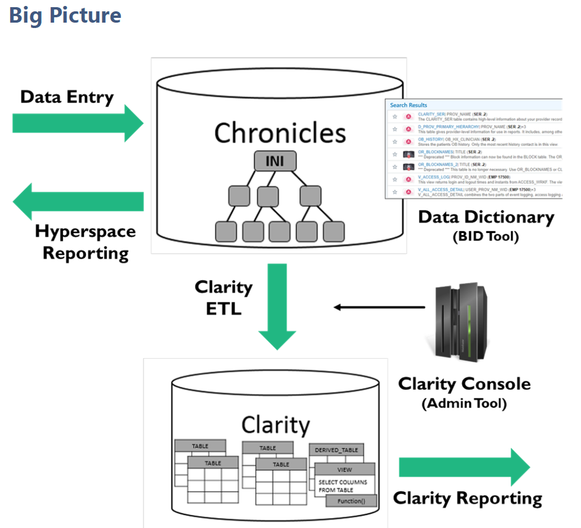
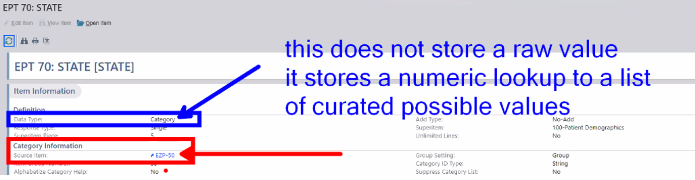
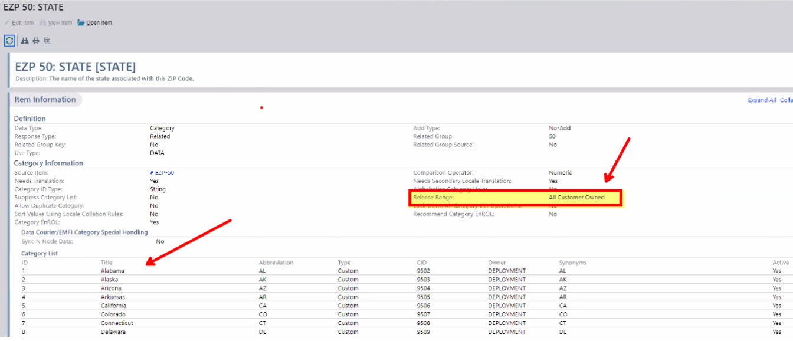
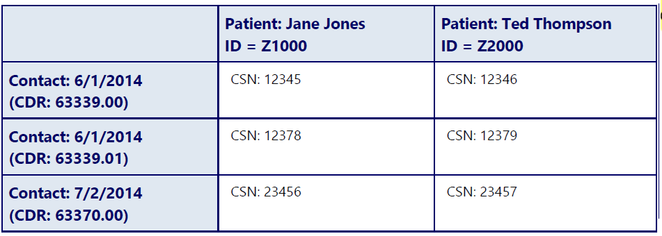
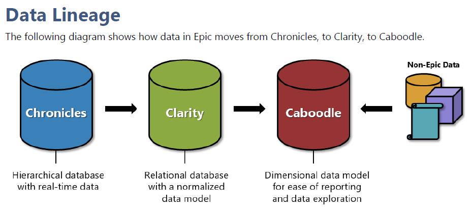
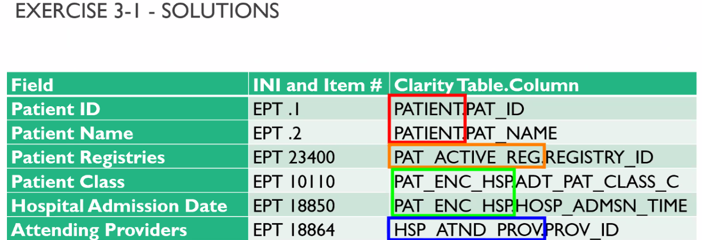
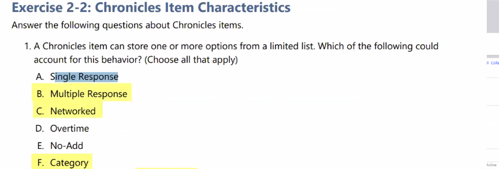
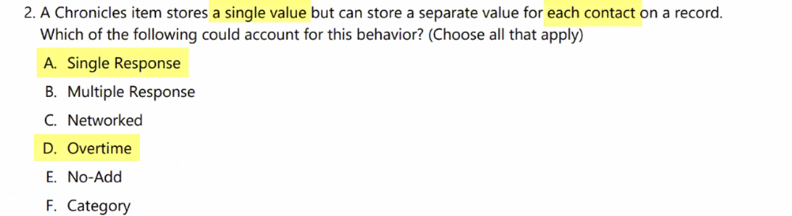
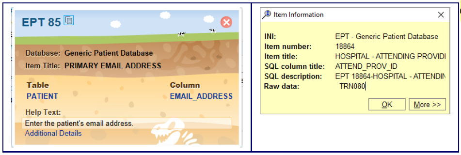
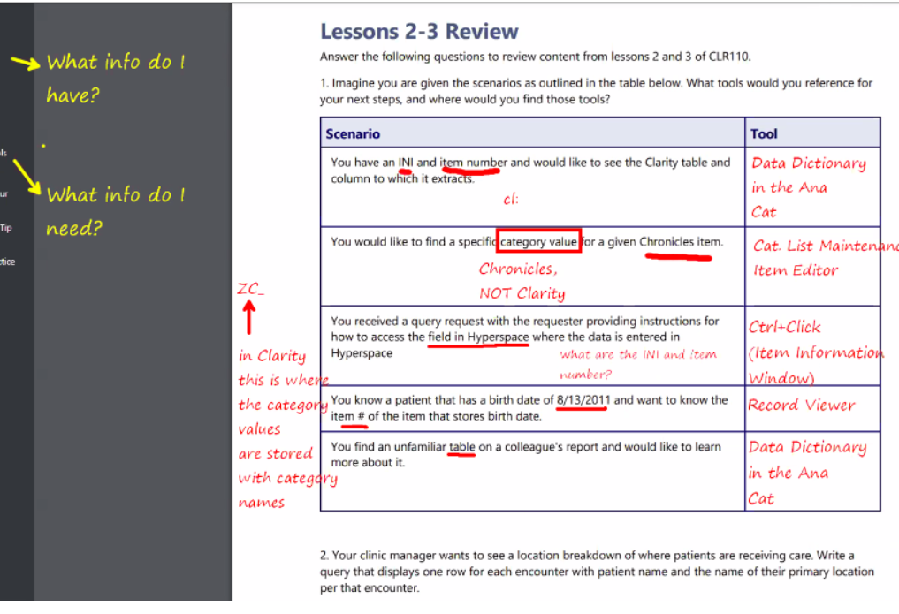

    
# Epic Clarity 

## Training materials for EPIC Clarity.

    

    
## Table of Contents

- [Solution Overview](#solution-overview)
- [Who will use this ?](#who-can-use)
- [Advantages of Using](#advantages-of-using)
- [Return on Investment (ROI)](#return-on-investment-roi)
- [How it Works](#how-it-works)
- [Conclusion](#conclusion)
- [Getting Started](#getting-started)
- [Solution Features](#solution-features)
- [Code Features](#code-features)
- [Deliverables or Figures](#deliverables-or-figures)
- [Contact Information](#contact-information)

## Introduction to CLR110 Clarity Data Model Fundamentals  Chapter 1

1. Prerequisites and Expectations
2. How to Use This Training Companion
3. View a Training Companion With and Without Answers
4. Contact Information
5. After Class Practice
6. Epic Resources
7. Data Lineage

## Prerequisites and Expectations

Before undertaking the course of study within this class, you must have completed the following tasks
1. Attend **COG170 Cogito Fundamentals**
2. Complete the RPT101i SQL I self study
3. Complete the SQL I Self Assessment
4. Attend CDW110v Caboodle Data Model Fundamentals

## How to Use This Training Companion

This training companion is for use in conjunction with other course materials.

Note that new training materials are released regularly throughout the year. If you downloaded this
companion even a few weeks or months ago, there may be a new version that you should use instead. At
the beginning of this companion, look at the version and dates listed. If you  complete a task after its
listed date, be sure to check the All Training Companion Change Log to see if there are significant
changes to the new materials.

If there are, be sure to download the new materials when theyre released.
Youll find informative text boxes and do now steps throughout the lessons to draw your attention to
specific content. There are a few different types of text boxes you might encounter. Each has a different
purpose as defined below

## After Class Practice

After class, you will likely want to practice in the system and complete additional in class or if you have time
exercises. Please reference the following documents available on Galaxy for information on how to log in and use our 
practice system.

## Data Lineage 

Data in Epic moves from Chronicles, to Clarity, to Caboodle.

## Investigating Chronicles chapter 2 has 6 questions on exam
 
1. Introduction to Investigating Chronicles 
2. Receiving a Clarity Query Request
3. Hospital Admission Report Request
4. Conducting Chronicles Research
5. Item Information Window (Ctrl + Click Method)
6. Limitations of Ctrl + Click
7. Record Viewer
8. Finding an item in the Record Viewer
9. Formatting in the Record Viewer
10. Including Blanks
11. Item Editor
12. Category List Maintenance
13. Exercise 2 1  Hospital Admissions Query Research  Chronicles
14. Exercise 2 2  Chronicles Item Characteristics
15. Reference  Chronicles Item Characteristics
16. Add Type and Response Type
17. Add Type
18. Response Type
19. Reviewing the Chapter

## Introduction to Investigating Chroncles chapter 2

### This chapter has 6 questions on the test
 

The structure of the Clarity database is largely determined by the structure of **Chronicles**, where the data
begins. 

In this lesson, you will discover how to locate data in Chronicles using a variety of tools. 

Later, you use your research skills to follow and locate this data in Clarity. will follow this data.

By the End of This Lesson, You Will Be Able To...
1. Use Epic tools for Chronicles research
2. Identify an items add type and response type
3. View or look up category values

##  Receiving a Clarity Query Request

Upon receiving a report request, you will typically

0. Identify the **data elements** you will need for the report.
1. **Find the INI + item numbers of the data points** to use on the report.
2. Use the INI + item numbers to find the appropriate **Clarity tables and columns**.
3. **Join the Clarity tables together** using the correct foreign key information.

Step 0, while not specific to writing reports in Clarity, is an extremely important step. Imagine a request to
show all patients attributed to each provider. There are many ways providers can be matched to patients.
Does your report requester want the admitting provider, the discharge provider, the patients primary care
provider, or something else? Identifying what the report request needs will help you plan your report and
research Chronicles. A great resource to use to help with this step is your report requester or a subject
matter expert (SME).

Once you know what data elements you need for your report, find the INI + item number for each
element. The INI + item number is the Chronicles address for a piece of data. It is with this Chronicles
address that you can map the data point to the appropriate table and column in Clarity.

##  Hospital Admission Report Request

Read through the following report request.

Your organization wants to reduce the number of hospital admissions to reduce costs and
improve patient care. You have been tasked with finding all patients on the Wellness registry
(male or female 30   49) with an inpatient stay or an emergency department visit within the
past five years, along with their attending providers if one is documented.

This report could be research for a report on readmissions. When a patient gets readmitted
to the hospital, it is a sign that perhaps the patient was not properly cared for the first time.
Many organizations thus create initiatives to reduce hospital readmissions to prevent
expensive hospital stays and provide better patient care.

When you are given a report request, you should begin by making sure you know what data elements
you need to complete the report. We did that step for you, so that will bring us to 
1. step 1, finding your INI + item numbers in Chronicles.
2. Knowing the workflow where the data is entered into the system, or having a sample record that you can investigate with the Record Viewer will be the first step to creating a Clarity
report. 
3. When you are looking for sample data or help with a workflow, reach out to your application analysts or subject matter experts.

##  Conducting Chronicles Research

When you begin your research, there are a few activities in Chronicles that can be used to look up

1. information about the data in Chronicles including
2. Item Information window (Ctrl + Click)
3. Record Viewer
4. Item Editor

 
### Item Information Window (Ctrl + Click Method)
If you do not know where the data is stored, work with an application analyst or a report requester to help
find the data. One tool that a user can use in Hyperspace to find the **INI** and **item number** for data is the
**Item Information window**. The Item Information window is used when you are in the workflow and can
edit the field where the data is entered as an end user.

### Item Information Window
When you **control left click** on a data entry field in Hyperspace, the Item Information window appears.
This window provides the INI and item number in which this data is stored, a Clarity table and column,
and the items help text.

##  Limitations of Ctrl + Click

The Ctrl + Click method typically works on readwrite fields in Hyperspace. Although this method is the
most convenient way to find a piece of data, it does not work for all data points. If a field is read only, Ctrl
+ Click will often not work, and even some editable fields will not open the Item Information window
when the control click workflow is completed.

In the patients story board, you notice that the patient has a patient class of Inpatient. While
this is stored on the patients record, it is not editable here. When a field is not editable, it is
less likely that the Item Information window will work.

##  Record Viewer

The **Record Viewer** is an activity in Hyperspace that provides a read only view of raw data within a
Chronicles record. It shows all items set on a particular contact of a particular record. To view data, you
must specify the Master File, Record, and Contact for the data you want to see.

When the Ctrl + Click method does not work for a Hyperspace field, or the report requester does not
know the field where a data point was entered, the Record Viewer is the most convenient place to find the
INI + Item number for a piece of data.

### Finding an item in the Record Viewer

When you know specific record or contact identifying information, you can use the Record Viewer to view
the values stored. Identifying information includes the record ID ..1., an external ID, or a contact serial
number .CSN.. Use the Record Viewer to see what is stored for that contact or to see related data within
the master file and how it fits together.

You want to investigate the filter on the report that asks for only Inpatient or Emergency visits. The report
requester is unsure where the information was entered into Chronicles, so you cannot Ctrl + Click and
thus must look up the item in the Record Viewer.

You want to investigate the filter on the report that asks for only Inpatient or Emergency visits. The report
requester is unsure where the information was entered into Chronicles, so you cannot Ctrl + Click and
thus must look up the item using Record Viewer.

##  Formatting in the Record Viewer
 
The data in the Record Viewer is formatted for easy viewing. For example, items that are part of a related
group are displayed next to each other in a table, category items display both the value and the name of
the category they hold, and networked items display both the ID and the name of the record they network to.

Keep in mind that the Record Viewer formatting does not necessarily translate to what is stored in Clarity.

#### Observe the screenshot below.

Formatted data in the Record Viewer for a category value

This item, EPT 10110, stores the patients class as part of a category list. When displaying the value for this
item, the Record Viewer displays Inpatient [101]. Here we see the category value of 101 in brackets, and
the name of the category fully displayed.

However, the raw data stored in Chronicles is only the category value. Thus, when the item is extracted to
Clarity, only the category value of 101 will carry over. 
 
Including Blanks

15 In the Item Filters Card, check the box Include Blanks.

Note that there are many items that exist in a master file that are not filled out for every record. This is
common with medical data, since patients undergoing different levels of care will have different data that is important to document. If Include Blanks is enabled, the Record Viewer it will display all possible items.
By default, it will separate the items into different pages for master files with many items.
 

##  Item Editor
 
 
The Item Editor shows the definitions of a Chronicles item. Note that it does not show a particular value
stored in the item. Instead, it shows information about how the item behaves for all values.

Because there are many items within a master file that may sound similar, the Item Editor is useful for
investigating the properties of a given item. Comparing properties can help you decide which item is
most appropriate to include in your query.
 

##  Category List Maintenance
 
Some items in Chronicles have a data type of Category. These items are populated by a limited list of
options, called a category list. When using a category list value as a filter, the query can run more
efficiently when filtering on the category value rather than the name in the category list table. To find the
name to display for a particular value, you need to see the category list.

It is possible for multiple items in Chronicles to reference the same category list. In a situation like that,
the Item Editor stores a link in the Where found field. That link indicates where Chronicles stores the
category list.
 

##  Excercise 2 1  Hospital Admissions Query Research   Chronicles
 
Your organization wants to reduce the number of hospital admissions to reduce costs and
improve patient care. You have been tasked with finding all patients on the Wellness registry
(male or female 30   49) with an inpatient stay or an emergency department visit within the
past five years, along with their attending providers if one is documented.

Below, we listed out the data elements that we will be using in this report request. Begin the process of
completing the Clarity query by finding the Chronicles items.

Use the Sample Data Point section along with the Record Viewer, Item Editor, and Category List
Maintenance to conduct your research.

### Sample Data Point

Your Aubrey patient is on the Wellness Registry Female 30 49. On 4219 a hospital encounter was
created for Aubrey where she had an inpatient stay with a hospital admission on 33119 with Walt
Whitecoat as one of her attending providers.

### Additional Context
 **Patient ID (internal)** This field stores the internal ID of the patient record, which is not the patients MRN.
 **Patient Name** This field stores the name of the patient, which is the same as the name of the record in EPT.
 **Patient Registries** This field references the entire list of registries the patient is included in. Aubrey is on the Active Patients Registry as well as the Wellness Registry Female 30 49.
 **Patient Class** This field categorizes the type of visit into categories such as inpatient, outpatient, or emergency. Aubreys hospital encounter was an inpatient encounter.
 **Hospital Admission Date** This field stores the date the patient was first admitted to the facility, bedded in the ED, or confirmed for an HOV. There are many dates and times on a patient contact. Be sure to read the
 **Attending Providers** Walt Whitecoat was one of Aubreys attending providers.

Some encounters may not have an attending provider documented

## Excercise 2 2  Chronicles Item Characteristics

Answer the following questions about Chronicles items.

1. A Chronicles item can store one or more options from a limited list. Which of the following could
account for this behavior? (Choose all that apply)
 Single Response
 Multiple Response
 Networked
 Overtime
 No Add
 Category

2. A Chronicles item stores a single value but can store a separate value for each contact on a record.
Which of the following could account for this behavior? (Choose all that apply)
 Single Response
 Multiple Response
 Networked
 Overtime
 No Add
 Category

## Reference Chronicles Item Characteristics

 
For a more detailed explanation of all Chronicles item characteristics, see the Data Lineage
and Data Lineage Practice sections from the COG170 Cogito Fundamentals training
companion.

### Add Type and Response Type
#### Add Type

An items add type describes how long a piece of data is valid. It determines whether an items value is
stored on each contact, or directly to the record.

When looking at a patients chart, a clinician will want to know not just the patients current weight, but
how their weight has varied over time. This type of information should be stored on a contact. On the
other hand, if a registrar needs to change a patients date of birth, it probably doesnt mean the patients
date of birth has actually changed. Instead, it probably means the value originally entered was incorrect.
This type of information should be stored on a record.

These different types of data storage needs are reflected in the different add types.

## Reference Chronicles Item Characteristics

An items response type determines how many lines of data an item can hold. For example, at any one
time, a patient has only one date of birth, but can have multiple symptoms, or a multi line address. 

### Response Type

## Reviewing  Chapter 2 

###  Review Questions

1. A lab manager tells you he wants a report on lab specimens and shows you the field where he can
input various information. What method would you use to find the INI + Item numbers of the data
hes looking for?

2. A clinical administrator requests a query to include data for a patients registries. Shes not sure of
the INI and item number, but she knows the patient is on the Lung Cancer Screening registry. What
tool would you use to find the INI and item number given this information?

3. In Clarity, which of the following columns COULD contain a NULL value?
    1. A foreign key column that would store the patients primary care provider
    2. A date column that would store the discharge date for an encounter
    3. A string column that stores a patients email address
    4. A numeric column that stores the patients age in years
    5. A column that is the primary key of a table

## Chapter 3  Investigating Clarity  CLR110 Clarity Data Model Fundamentals
 Big Picture
 Conducting Clarity Research
 Data Dictionary
      Search the Cogito Dictionary
      Overview Section
      Columns Section
      Data Types
      Category List Tables
      Chronicles Info
      Dependencies
      Indexes
 Beyond the Basics Cogito Documentation
 Exercise 3 1 Hospital Admissions Query Research   Clarity
 The ETL Process
      Tools Used in the Clarity ETL Process
      Load Frequencies
      Changes to Existing Tables and Columns
           Deprecation
           Identifying Changes between Versions
      Extracted to Clarity
           Core Tables
 In Class Exercises
      Exercise 3 2 Query PAT_ENC
      After Class Exercise 3 3 Further Exploring the Cogito Dictionary
 Reviewing Chapter 3 

## The Big Picture 

## Conducting Clarity Research
 
In the Investigating Chronicles lesson, you learned the three step process in order to find Clarity tables
and columns given a Chronicles sample data point.

1. Find the INI + Item number of the data point to use on the report.
2. Use the INI + Item number to find the appropriate Clarity table and column.
3. Join the Clarity tables together using the correct foreign key.

In this section, you will learn how to complete Step 2. After finding the INI and item numbers that store
the source data youd like to include in your query, the Data Dictionary, within the Analytics Catalog, can
find the Clarity tables and columns you need.

## Data Dictionary
 
The Data Dictionary contains descriptions of Clarity and Caboodle tables and columns, important
characteristics of each database object, table level and column level data lineage, information to help
identify joins, and more. Access it from the Analytics Catalog.

To open the Analytics Catalog, search Analytics Catalog or click on the name of the current dashboard and
click Show Catalog. To find Clarity and Caboodle tables in the Analytics Catalog, filter the catalog for a
specific database using

The Cogito Dictionary supports searching by INI and item number and will return database objects in
Clarity or Caboodle that reference that item. This also allows report writers to use the dependencies
section of the Summary form to identify Caboodle database objects that depend on a specific Clarity
table.

## Data Types
 
The data types used by Chronicles are String, Number, Date, Time, Instant, and Category. However, when
the ETL process transforms this data into a relational format, it also converts the data into standard
datatypes used by relational databases (the ANSI standard). Depending on the columns datatype, there
may be a secondary characteristic defined as well. For example, for a VARCHAR, you can define the
maximum length the column can hold.

## Category List Tables
 
The data types used by Chronicles are String, Number, Date, Time, Instant, and Category. However, when
the ETL process transforms this data into a relational format, it also converts the data into standard
datatypes used by relational databases (the ANSI standard). Depending on the columns datatype, there
may be a secondary characteristic defined as well. For example, for a VARCHAR, you can define the
maximum length the column can hold.

## Mapping Chronicles Relationships in Clarity

1. Introduction to Mapping Chronicles Relationships in Clarity
2. Granularity in Clarity
3. Why doesnt one Chronicles master file translate into one Clarity table?
4. Table Granularity
5. Key Item Characteristics
6. Identifiers
7. Identifying Chronicles Records
8. Identifying Chronicles Contacts
9. Identifying Lines
10. Exercise 4 1  The Clarity Data Model for EPT
11. The Clarity Data Model
12. Clarity Data Model Chart
13. Key Principles
14. Linking Between Tables
15. Linking Diagrams
16. Exercise 4 2  Using the Linking Diagram
17. In Class Demo Cardinality
18. Begin Research in Chronicles
19. Exercise 4 3  Hospital Admissions Query 
20. Fields
21. Linking Diagram
22. If You Have Time   Exercise 4 4 Misleading Results
23. Using Networked Items to Inform Joins
24. Chronicles Research
25. Identifying Clarity Tables and Columns
26. Mapping Chronicles Relationships in Clarity 4   1
27. Join Tables Together Using Correct Foreign Keys
28. Exercise 4 5  Finishing the Hospital Admissions Query
29. If You Have Time   Exercise 4 6 Hospital Charges Query
30. Reviewing the Chapter

 

    

    
## Getting Started

The goal of this solution is to **Jump Start** your development and have you up and running in 30 minutes. 

To get started with the **Epic Clarity** solution repository, follow these steps:
1. Clone the repository to your local machine.
2. Install the required dependencies listed at the top of the notebook.
3. Explore the example code provided in the repository and experiment.
4. Run the notebook and make it your own - **EASY !**
    
## Solution Features

- Easy to understand and use  
- Easily Configurable 
- Quickly start your project with pre-built templates
- Its Fast and Automated
- Saves You Time 

## Code Features

These features are designed to provide everything you need for **Epic Clarity** 

- **Self Documenting** - Automatically identifes major steps in notebook 
- **Self Testing** - Unit Testing for each function
- **Easily Configurable** - Easily modify with **config.INI** - keyname value pairs
- **Includes Talking Code** - The code explains itself 
- **Self Logging** - Enhanced python standard logging   
- **Self Debugging** - Enhanced python standard debugging
- **Low Code** - or - No Code  - Most solutions are under 50 lines of code
- **Educational** - Includes educational dialogue and background material

    
## List of Figures
                                                 
    

## Github https://github.com/JoeEberle/ - Email  josepheberle@outlook.com 
    

    